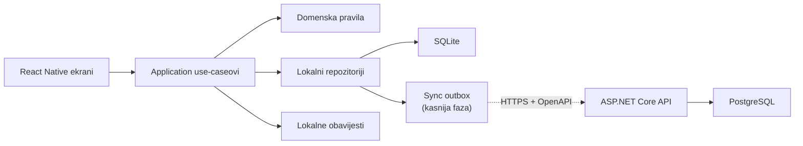

# Higio — master-plan proizvoda i razvoja

## Aktualna odluka — 10. rujna 2026.

Android je primarna i obvezna platforma: završetak lokalnog MVP-a zahtijeva
provjeru na fizičkom Android mobitelu. Postojeća iOS kompatibilnost ostaje,
a iOS build, TestFlight i Apple račun dolaze tek nakon stabilnog Androida.
Backend i cloud uvode se samo ako lokalna beta pokaže stvarnu potrebu.
Ova odluka ima prednost pred starijim redoslijedom faza u ovom dokumentu.

Suplementi se uklapaju u postojeće kategorije i dnevne termine. Paket sadrži
kreatin (3 tablete), magnezij, Omega-3 i multivitamin (po 1 tabletu).
Jedan dodir znači cijelu prikazanu dozu; nema brojanja pojedinačnih tableta
ni medicinskih preporuka. Oznaka doze pripada verziji rasporeda i kopira se
u zapis izvršenja. Promjena vrijedi od sutra; naknadni unos koristi dozu
važeću na odabranom datumu, a promjena vremena postojećeg zapisa zadržava
njegovu spremljenu dozu. Stari zapisi bez doze zadržavaju praznu vrijednost.

Plan i dokazi: [Suplementi](SUPPLEMENTS_PLAN.md).

Datum odluke: 25. srpnja 2026.

## 1. Sažetak odluke

Higio će biti prava mobilna aplikacija za Android i iOS, a ne responzivna web-aplikacija zapakirana kao mobilna aplikacija.

Odabrani smjer:

- **mobilna aplikacija:** React Native 0.86, Expo SDK 57 i TypeScript
- **navigacija:** Expo Router
- **lokalni podatci:** SQLite preko `expo-sqlite`
- **tipizirani pristup bazi i migracije:** Drizzle ORM
- **obrasci i validacija:** React Hook Form i Zod
- **lokalne obavijesti:** `expo-notifications`
- **backend nakon lokalnog MVP-a:** .NET 10 LTS, ASP.NET Core Web API i EF Core 10
- **serverska baza:** PostgreSQL 18
- **buildovi za uređaje i trgovine:** Expo development builds i EAS Build
- **izvorni kod:** jedan Git repozitorij, bez mikroservisa i bez monorepo frameworka

Prvi korisni proizvod neće zahtijevati registraciju ni internet. Podatci će se spremati na uređaju. Korisnički račun, sigurnosna kopija i sinkronizacija između uređaja uvode se kasnije, nakon što osnovno iskustvo bude dokazano.

To je namjerna produktna odluka: početak korištenja mora trajati manje od minute, a označavanje aktivnosti manje od dvije sekunde.

## 2. Pozicija proizvoda

Higio nije generički habit tracker i ne pokušava pratiti sve navike korisnika.

Higio je:

> Osobni tracker higijene i njege koji pokazuje što je danas planirano, kada je nešto posljednji put obavljeno i kako se rutina mijenjala kroz vrijeme.

Primjeri aktivnosti:

- pranje zubi ujutro i navečer
- korištenje zubnog konca
- tuširanje
- pranje kose
- jutarnja i večernja njega kože
- brijanje
- rezanje noktiju
- promjena ručnika i posteljine
- zamjena četkice ili britvice
- odlazak frizeru

Ključna razlika prema običnom checklistu jest da Higio razumije raspored i povijest. Rezanje noktiju nije dnevna navika, pranje zubi ima dva dnevna termina, a brijanje može biti aktivnost bez fiksnog rasporeda.

## 3. Produktna načela

Sve odluke tijekom razvoja moraju poštovati sljedeći redoslijed prioriteta:

1. **Brzina evidentiranja.** Uobičajena aktivnost završava se jednim dodirom.
2. **Jasnoća.** Početni ekran pokazuje samo ono što je korisniku trenutačno relevantno.
3. **Rad bez interneta.** Sve osnovne funkcije rade lokalno i trenutačno.
4. **Privatnost.** Podatci nisu javni i ne šalju se na server bez jasne korisnikove odluke.
5. **Točna povijest.** Korisnik može ispraviti pogrešno vrijeme, dodati propušteni zapis i poništiti slučajni dodir.
6. **Nenametljiv ton.** Aplikacija podsjeća, ali ne posramljuje korisnika i ne kažnjava ga zbog prekinutog niza.
7. **Prilagodljivost bez kaosa.** Aktivnosti se mogu prilagoditi, ali početno iskustvo koristi dobre predloške.
8. **Postupna složenost.** Napredne mogućnosti pojavljuju se tek kada su potrebne.

## 4. Mjerljivi UX ciljevi

Ovi ciljevi služe kao kriteriji dizajna i testiranja:

- prvi ulazak do prikaza korisne današnje liste: **manje od 60 sekundi**
- evidentiranje aktivnosti s početnog ekrana: **jedan dodir i manje od 2 sekunde**
- poništavanje slučajnog evidentiranja: **jedan dodir iz poruke za poništavanje**
- naknadni unos aktivnosti: **najviše tri jasna koraka**
- stvaranje jednostavne aktivnosti: **manje od 30 sekundi**
- aplikacija mora otvoriti postojeće podatke i bez mreže
- dodirne površine moraju biti najmanje 44 × 44 pt/dp
- osnovni tokovi moraju raditi s većim sistemskim fontom i čitačem zaslona

## 5. Zašto je odabran React Native s Expom

### Prednosti za Higio

- jedna TypeScript baza koda za Android i iOS
- stvarne native kontrole i kvalitetniji mobilni osjećaj od WebView aplikacije
- odlična podrška za lokalne obavijesti, haptiku, SQLite, deep linkove i kasnije widgete
- Expo development build omogućuje korištenje native modula bez ručnog održavanja cijelog native projekta
- EAS može graditi iOS aplikaciju i kada se razvoj primarno radi na Windows računalu
- TypeScript je već poznat vlasniku projekta
- manji rizik i kraći razvoj od odvojenog Kotlin i Swift koda

### Zašto nisu odabrane alternative

**Ionic/Angular + Capacitor** bio bi najbliži postojećem Angular znanju, ali Higio je prvenstveno mobilni proizvod. React Native daje prirodnije mobilne interakcije i bolji dugoročni put prema widgetima, animacijama i platformskim mogućnostima.

**Flutter** je tehnički vrlo dobar, ali bi uveo Dart bez dovoljno velike koristi za ovakav proizvod.

**.NET MAUI** bi omogućio C#, ali trenutačno nema prednost nad Expo ekosustavom za brz razvoj, mobilni UX i dostupne gotove integracije.

**Nativni Kotlin i Swift** daju maksimalnu platformsku kontrolu, ali udvostručuju razvoj i održavanje. Za prvu verziju to nije opravdano.

**PWA** može biti budući dodatni klijent, ali ne i glavni proizvod. Pouzdanost podsjetnika i osjećaj korištenja nisu jednaki na svim mobilnim platformama.

## 6. Tehnološki stack

### 6.1 Mobilna aplikacija

| Područje | Odabir | Razlog |
|---|---|---|
| Runtime | Expo SDK 57 / React Native 0.86 | Aktualna stabilna kombinacija s podržanim native modulima |
| Jezik | TypeScript u strict načinu | Sigurnije refaktoriranje i jasniji domenski modeli |
| Navigacija | Expo Router | Tipizirane rute, deep linkovi i jednostavna struktura ekrana |
| Lokalna baza | `expo-sqlite` | Trajni offline podatci, transakcije i dobre lokalne statistike |
| ORM/migracije | Drizzle ORM | Tipizirana schema i kontrolirane migracije bez teškog frameworka |
| Validacija | Zod | Jedna jasna pravila validacije za forme i granice sustava |
| Forme | React Hook Form | Malo ponovnih renderiranja i dobra integracija sa Zodom |
| Stanje | lokalno stanje + mali application store po potrebi | Bez Reduxa dok se ne pokaže stvarna potreba |
| Obavijesti | `expo-notifications` | Lokalne planirane obavijesti i budući push |
| Sigurne vrijednosti | `expo-secure-store` | Tokeni i osjetljive postavke ne pripadaju u običan storage |
| Animacije | Reanimated samo za korisne mikrointerakcije | Brza povratna informacija bez dekorativnog pretjerivanja |
| Stilovi | React Native StyleSheet + vlastiti design tokeni | Mala ovisnost o UI bibliotekama i puna kontrola nad izgledom |
| Testovi | Jest, React Native Testing Library, Maestro | Jedinični, komponentni i najvažniji end-to-end tokovi |

Nećemo unaprijed dodavati Redux, veliku UI biblioteku, GraphQL, RxJS ni složen state machine framework.

### 6.2 Backend nakon lokalnog MVP-a

| Područje | Odabir | Razlog |
|---|---|---|
| Runtime | .NET 10 LTS | Aktivna LTS verzija podržana do studenoga 2028. |
| API | ASP.NET Core 10 Web API | Stabilan, brz i dobro poznat smjer za projekt |
| Podatci | EF Core 10 | Migracije, modeliranje i dobra PostgreSQL podrška |
| Baza | PostgreSQL 18 | Otvoren, prenosiv i jeftiniji izbor za više cloud opcija |
| Provider | Npgsql 10 | Službeno usklađen s EF Coreom 10 |
| API ugovor | OpenAPI | Generiranje tipiziranog TypeScript klijenta |
| Testovi | xUnit + Testcontainers za PostgreSQL | Testiranje stvarnog ponašanja baze |
| Observability | strukturirani logovi i OpenTelemetry; Sentry po potrebi | Dovoljno za dijagnostiku bez teške infrastrukture |

Backend u prvoj serverskoj verziji ostaje modularni monolit. Ne uvodimo mikroservise, CQRS, MediatR ni repository sloj iznad EF Corea bez konkretne potrebe.

### 6.3 Alati i isporuka

- Node.js 24 LTS za novu razvojnu instalaciju
- npm kao početni package manager
- .NET SDK 10
- Git i GitHub
- GitHub Actions za provjere koda
- Expo development build za svakodnevni razvoj na uređaju
- EAS Build za Android/iOS preview i produkcijske buildove
- Android uređaj kao primarna razvojna platforma
- TestFlight kao obvezna iOS provjera prije javne objave

## 7. Arhitektura



Ovisnosti idu prema unutra:

- ekran smije pozvati use-case
- use-case smije koristiti domenska pravila i sučelje repozitorija
- SQLite i API su implementacijski detalji
- UI ne smije sadržavati SQL ni računanje rasporeda

Predložena konačna struktura repozitorija:

```text
Higio/
├── apps/
│   └── mobile/
│       ├── src/app/              # Expo Router ekrani
│       ├── src/features/         # aktivnosti, danas, povijest, statistika...
│       ├── src/domain/           # modeli i čista pravila rasporeda
│       ├── src/data/             # SQLite schema, migracije, repozitoriji
│       ├── src/design-system/    # tokeni i male zajedničke komponente
│       └── tests/
├── services/
│   └── api/                      # dodaje se tek u cloud fazi
├── docs/
├── .github/
└── README.md
```

Ne uvodimo Nx, Turborepo ili sličan monorepo alat dok repozitorij nema stvarnu potrebu za njim.

## 8. Osnovni domenski model

Model mora razlikovati definiciju aktivnosti, planirani termin i stvarno izvršenje.

### `Activity`

Definira što korisnik prati:

- ID
- naziv
- opcionalni opis
- kategorija
- ikona i boja
- aktivno, pauzirano ili arhivirano
- datum početka i opcionalni datum završetka
- redoslijed prikaza

### `Schedule`

Definira kada se aktivnost očekuje. U prvoj punoj verziji podržavamo četiri modela:

1. određeni dnevni termini, primjerice jutro i večer
2. određeni dani u tjednu
3. svakih N dana ili tjedana
4. bez rasporeda, samo evidentiranje

Ne gradimo univerzalni kalendarski jezik u prvoj verziji.

### `ScheduleSlot`

Predstavlja dio dana ili vremenski prozor:

- jutro
- tijekom dana
- večer
- prilagođeni termin

Pranje zubi može imati dva slota istoga dana, a svaki slot dobiva zasebno planirano izvršenje.

### `ActivityLog`

Predstavlja činjenicu da je aktivnost obavljena:

- ID
- ID aktivnosti
- stvarno vrijeme izvršenja
- opcionalni planirani slot
- vrijeme kada je zapis kreiran
- izvor zapisa: ručno, cijela rutina, widget ili kasnija sinkronizacija
- opcionalna kratka bilješka
- soft-delete podatci za ispravke i sinkronizaciju

Log je događaj i ne smije se prepisati novim stanjem checkboxa. Povijest se izračunava iz logova.

### `Routine`

Grupa aktivnosti, primjerice jutarnja ili večernja rutina. Uvodi se nakon stabilnog pojedinačnog evidentiranja.

### Pravila vremena

- stvarni timestamp sprema se u UTC-u
- sprema se IANA vremenska zona korisnika za računanje lokalnog dana
- rasporedi se računaju u lokalnom vremenu
- promjena vremenske zone ne smije prebaciti stare zapise u pogrešan dan
- ljetno i zimsko računanje vremena moraju imati automatske testove

### Pravila statistike

- u nazivnik ulaze samo termini planirani dok je aktivnost aktivna
- pauzirani dani ne smanjuju uspješnost
- naknadno uneseni zapis ulazi na odabrani stvarni datum
- jedan log ne smije zadovoljiti dva različita termina
- više logova za aktivnost bez rasporeda dopušteno je
- postotak se ne prikazuje ako nema planiranih termina
- nizovi izvršenja nisu glavna metrika i ne koriste posramljujuće poruke

## 9. Glavna navigacija i ekrani

Primarna donja navigacija:

1. **Danas**
2. **Povijest**
3. **Statistika**
4. **Više**

### Danas

Najvažniji ekran aplikacije:

- pozdrav i datum bez nepotrebnog dashboarda
- sekcije Jutro, Tijekom dana, Večer i Kada stigneš
- velike kartice aktivnosti
- jedan dodir evidentira trenutačno vrijeme
- kratka haptika i jasna promjena stanja
- snackbar nudi `Poništi`
- dugi pritisak ili izbornik omogućuje drugo vrijeme, bilješku, preskakanje ili detalje
- budući termini su vidljivi, ali vizualno mirniji
- aktivnosti bez rasporeda dostupne su kroz brzu akciju

### Povijest

- vremenska crta po danima
- filtriranje po aktivnosti i kategoriji
- dodavanje propuštenog zapisa
- ispravljanje vremena
- brisanje pogrešnog zapisa uz mogućnost poništavanja

### Statistika

- tjedni i mjesečni pregled
- planirano nasuprot obavljenom
- trend posljednjih 7 i 30 dana
- posljednje izvršenje
- prosječni razmak za intervalne i neplanirane aktivnosti
- detalj pojedine aktivnosti

### Više

- upravljanje aktivnostima
- rutine
- podsjetnici
- predlošci
- postavke
- izvoz i sigurnosna kopija
- korisnički račun i sinkronizacija kada budu dostupni

## 10. Opseg verzije 1.0

### Obvezno

- onboarding bez obvezne registracije
- početni predlošci i mogućnost preskakanja
- kreiranje, uređivanje, pauziranje i arhiviranje aktivnosti
- četiri osnovna tipa rasporeda
- ekran Danas
- evidentiranje jednim dodirom
- undo
- naknadni unos i ispravak zapisa
- povijest
- tjedna i mjesečna statistika
- lokalni, opcionalni i grupirani podsjetnici
- jutarnje i večernje rutine
- lokalni izvoz i povrat podataka
- pristupačnost, dark mode i osnovna privatnost
- Android i iOS build

### Nije dio prve verzije

- medicinski savjeti ili dijagnoze
- AI analiza zdravlja
- javni profili i društvena mreža
- natjecanja, bodovi i obvezni streakovi
- automatsko otkrivanje pranja zubi
- pametni sat
- obiteljski računi
- dijeljenje privatnih rutina
- napredni inventar proizvoda
- pretplate i plaćanja
- web ili desktop aplikacija

## 11. Faze razvoja

Procjene su radni rasponi za jednog developera i služe planiranju, a ne kao čvrsti rokovi.

### Faza 0 — produktni ugovor

Trajanje: 1–2 dana.

Cilj je zaključati problem, granice MVP-a i pravila koja utječu na cijelu arhitekturu.

Isporuke:

- konačna jedna rečenica opisa proizvoda
- popis obveznih i odgođenih funkcija
- točne definicije četiri vrste rasporeda
- pravila za `obavljeno`, `propušteno`, `pauzirano` i `nije planirano`
- početne kategorije i predlošci
- nacrt glavnih korisničkih tokova

Kriterij završetka:

- za pranje zubi, tuširanje, pranje kose, nokte i brijanje možemo jednoznačno objasniti što aplikacija prikazuje danas i kako računa statistiku

### Faza 1 — razvojno okruženje i kostur projekta

Trajanje: 1–3 dana.

Isporuke:

- popravljen i provjeren Node/npm alatni lanac
- Expo SDK 57 projekt iz eksplicitnog stabilnog predloška
- TypeScript strict
- Expo Router
- development, preview i production konfiguracije
- ESLint, formatiranje i provjere tipova
- osnovni Jest test
- GitHub Actions za lint, typecheck i test
- Expo development build na stvarnom Android uređaju
- osnovni `src` raspored i pravila ovisnosti

Kriterij završetka:

- čisti checkout može se instalirati, provjeriti i pokrenuti dokumentiranim naredbama
- aplikacija radi na fizičkom Android uređaju

### Faza 2 — UX kostur i design system

Trajanje: 3–5 dana.

Status: tehnički UX kostur implementiran i provjeren u Android API 36
development buildu 26. srpnja 2026. Taktilni osjećaj haptike još treba kratko
potvrditi na fizičkom telefonu.

Isporuke:

- design tokeni za boje, tipografiju, razmake i radijuse
- light i dark tema
- osnovne komponente: gumb, kartica aktivnosti, switch, input, sheet, snackbar i prazno stanje
- donja navigacija
- statični ekrani Danas, Povijest, Statistika i Više
- prototip jednim dodirom s haptikom i undo porukom
- provjera većeg fonta i veličine dodirnih površina

Kriterij završetka:

- na stvarnom uređaju glavni tok izgleda i ponaša se kao mobilna aplikacija
- korisnik bez objašnjenja zna kako označiti aktivnost

### Faza 3 — lokalna baza i domenska jezgra

Trajanje: 4–7 dana.

Status: implementirano 26. srpnja 2026. i uključeno u Android API 36
development build. SQLite trajnost provjerena je kroz gašenje i ponovno
pokretanje aplikacije na emulatoru.

Isporuke:

- SQLite inicijalizacija i verzionirane migracije
- Drizzle schema
- tablice za aktivnosti, rasporede, slotove, logove i postavke
- repository sučelja i lokalne implementacije
- UUID identifikatori prikladni za kasniju sinkronizaciju
- `createdAt`, `updatedAt` i `deletedAt` gdje su potrebni
- čisti domenski modul za računanje planiranih termina
- testovi za kraj mjeseca, prijestupnu godinu, promjenu vremenske zone i DST
- fiksna kućna zona `Europe/Zagreb` za lokalni MVP
- mali vertikalni dokaz: termin → one-tap log → full-screen potvrda → undo
- web preview koristi isti repository ugovor i `localStorage`; produkcijski
  Android/iOS put ostaje SQLite + Drizzle

Kriterij završetka:

- podatci prežive ponovno pokretanje aplikacije
- ista domenska funkcija za zadani dan uvijek vraća isti skup planiranih termina
- UI ne sadrži SQL

Provedena provjera:

- Drizzle migracija generirana iz sheme
- lint i TypeScript prolaze
- 13 automatiziranih testova prolazi
- Expo web bundle uključuje migracije bez bundling grešaka
- UI tok, reload i undo ručno su provjereni u pomoćnom web previewu

### Faza 4 — aktivnosti i ekran Danas

Trajanje: 5–8 dana.

Status: implementirana prva interna alpha 26. srpnja 2026.

Isporuke:

- kreiranje i uređivanje aktivnosti
- odabir kategorije, ikone i boje
- jednostavni dnevni i tjedni rasporedi
- prikaz planiranih aktivnosti po dijelu dana
- evidentiranje jednim dodirom
- optimistička promjena UI-ja i haptika
- poništavanje slučajnog unosa
- pauziranje i arhiviranje
- osnovna prazna i error stanja

Kriterij završetka:

- korisnik može cijeli tjedan pratiti osnovne dnevne aktivnosti bez ulaska u pomoćne ekrane
- uobičajeno evidentiranje ne otvara obrazac

Ovo je **prva interna alpha verzija**.

### Faza 5 — potpuni scheduling engine

Trajanje: 5–9 dana.

Status: implementirano i native provjereno 26. srpnja 2026.

Isporuke:

- više dnevnih slotova
- određeni dani u tjednu
- interval svakih N dana ili tjedana
- aktivnost bez rasporeda
- datum početka rasporeda
- sigurna promjena postojećeg rasporeda bez mijenjanja stare povijesti
- prikaz sljedećeg očekivanog termina
- pravila za zakasnjelo i naknadno evidentiranje
- prošireni automatski testovi matrice rasporeda

Napomena o granici: zakašnjelo intervalno izvršenje već se sprema s odvojenim
planiranim i stvarnim datumom. Korisnički tok za ručni unos proizvoljnog starog
datuma ostaje dio Faze 6 jer pripada povijesti i ispravcima.

Kriterij završetka:

- pet referentnih aktivnosti iz Faze 0 radi bez posebnih iznimki u UI-ju
- promjena rasporeda danas ne mijenja značenje povijesnih podataka

### Faza 6 — povijest i ispravci

Trajanje: 3–5 dana.

Status: implementirano i native provjereno 31. srpnja 2026.

Isporuke:

- vremenska crta zapisa
- filtriranje po datumu, aktivnosti i kategoriji
- ručno dodavanje propuštenog izvršenja
- promjena vremena postojećeg izvršenja
- uklanjanje pogrešnog zapisa
- detalj aktivnosti s posljednjim izvršenjima
- jasna potvrda za nepovratne izmjene

Implementacijske napomene:

- vremenska crta čita stvarne `activity_logs` zapise iz SQLite baze
- filtri podržavaju Danas, 7 dana, 30 dana ili sve, uz aktivnost i kategoriju
- ručni unos može ispraviti konkretan slobodan planirani termin ili ostati
  dodatno neplanirano izvršenje
- stvarno vrijeme sprema se kao UTC uz zagrebački lokalni datum, vrijeme i
  offset; nepostojeći DST termin se odbija, a ponovljeni jesenski sat obrađuje
  se deterministički
- uklanjanje je soft-delete nakon jasne potvrde, uz akciju `Poništi`
- svaki zapis otvara detalj s promjenom datuma/vremena i nedavnim izvršenjima
- zajednički store događaji odmah osvježavaju Povijest i Danas; isti logovi bit
  će jedini izvor za statistiku u Fazi 8

Kriterij završetka:

- korisnik može sam ispraviti svaki realan problem s evidencijom
- korekcije odmah mijenjaju Danas i statistiku

### Faza 7 — podsjetnici

Trajanje: 4–7 dana.

Status: implementirano, automatski testirano i native provjereno na Android API
36 emulatoru 1. kolovoza 2026.

Isporuke:

- traženje dozvole tek kada korisnik uključi podsjetnik
- lokalni podsjetnici po slotu ili rutini
- grupirana jutarnja i večernja obavijest
- skrivanje osjetljivog teksta na zaključanom zaslonu
- ponovno planiranje nakon uređivanja rasporeda, promjene vremenske zone ili restarta
- deep link iz obavijesti na odgovarajući ekran
- kontrola svih obavijesti iz postavki

Kriterij završetka:

- nema duplih ili zastarjelih obavijesti nakon promjene rasporeda
- aplikacija ostaje potpuno upotrebljiva bez dozvole za obavijesti

Implementacijske napomene:

- dozvola se traži samo nakon uključivanja glavnog prekidača
- jutro, tijekom dana i večer stvaraju najviše jednu grupiranu obavijest po danu
- planer održava 14-dnevni horizont i uspoređuje stabilni ključ i fingerprint sa
  stvarno zakazanim sistemskim obavijestima
- završetak termina, undo, promjena aktivnosti, povratak u aplikaciju i promjena
  postavki pokreću sigurno ponovno planiranje
- nazivi aktivnosti zadano se ne prikazuju; Android kanal koristi privatnu
  vidljivost zaključanog zaslona
- svi termini računaju se u `Europe/Zagreb`, uz determinističko DST ponašanje
- native provjera potvrdila je dijalog dozvole, Android kanal i 27 zakazanih
  lokalnih alarma bez duplikata

### Faza 8 — statistika

Trajanje: 4–7 dana.

Status: završeno 5. kolovoza 2026.

Isporuke:

- lokalni izračun planirano/obavljeno
- tjedni i mjesečni pregled
- 7-dnevni i 30-dnevni trend
- zadnje obavljanje
- prosječni razmak između izvršenja
- posebna prezentacija za aktivnosti bez rasporeda
- dostupne tekstualne alternative grafovima
- testirani denominatori i rubni slučajevi

Kriterij završetka:

- svi brojevi mogu se objasniti konkretnim zapisima u povijesti
- pauza aktivnosti i promjena rasporeda ne stvaraju lažno lošu statistiku

### Faza 9 — onboarding, predlošci i grupirane rutine

Trajanje: 4–6 dana.

Status: završeno 5. kolovoza 2026.

Isporuke:

- kratki onboarding
- prilagodljivi predlošci za oralnu higijenu, tijelo, kosu, kožu i osobne stvari
- mogućnost početka s praznom aplikacijom
- jutarnja i večernja rutina
- označavanje pojedinačnog koraka ili cijele rutine
- promjena redoslijeda aktivnosti
- nenametljive edukativne poruke

Kriterij završetka:

- novi korisnik dobiva koristan današnji ekran za manje od minute
- predložak nikada ne nameće medicinsku preporuku

### Faza 10 — sigurnost podataka, izvoz i privatna beta

Trajanje: 1–2 tjedna, uključujući stvarno korištenje.

Status: implementacijski dio dovršen 6. kolovoza 2026.; native beta validacija
i dvotjedna uporaba još traju.

Isporuke:

- izvoz svih lokalnih podataka u dokumentiranom formatu
- povrat podataka s provjerom verzije
- opcionalno zaključavanje aplikacije biometrijom
- privacy screen u app switcheru gdje platforma dopušta
- zaštita tokena i tajni u Secure Storeu
- audit dopuštenja i privatnosti
- crash reporting bez slanja sadržaja privatnih aktivnosti
- performance profiliranje
- E2E testovi ključnih tokova u Maestru
- interni Android build
- iOS TestFlight build
- najmanje dva tjedna stvarne uporabe

Implementirano:

- dokumentirani i strogo validirani `higio.local-backup` format verzije 1
- potpuni lokalni izvoz te atomski SQLite povrat nakon korisnikove potvrde
- zaštita od pogrešne verzije, prevelike datoteke, duplikata i prekinutih veza
- očuvanje uređajskih identifikatora obavijesti radi sigurnog ponovnog
  planiranja nakon povrata
- ekran `Više → Podatci i privatnost`
- Secure Store za male sigurnosne postavke vezane uz uređaj
- opcionalno biometrijsko zaključavanje s platformskim fallbackom
- zadana zaštita snimke zaslona i app-switcher prikaza
- blokirane nepotrebne Android storage i overlay dozvole te isključen
  automatski Android backup
- privacy-safe tehnički logger, root error boundary i mjerenje lokalnog starta,
  učitavanja ekrana Danas te export/restore operacija
- Maestro smoke tokovi za onboarding, one-tap i ulaz u backup ekran
- Android native prebuild, debug build i instalacija na API 36 emulator
- uspješan produkcijski Android/Hermes bundle svih 2.034 modula

Otvoreno prije oznake `feature-complete lokalna beta`:

- ručni export/restore round trip na fizičkom Android uređaju
- biometrija, haptika i background lock na fizičkom Android uređaju
- izvršenje Maestro tokova nakon instalacije Maestro CLI-ja
- iOS TestFlight build i stvarna Face ID/Touch ID/privacy provjera
- mjerenje hladnog pokretanja na fizičkom, po mogućnosti slabijem uređaju
- najmanje dva tjedna stvarne uporabe bez gubitka ili dupliciranja podataka

Kriterij završetka:

- nema gubitka ili dupliciranja podataka u beta uporabi
- hladno pokretanje i glavni ekran dovoljno su brzi na stvarnom uređaju
- postojeći podatci mogu se izvesti i uspješno vratiti

Nakon dovršetka otvorenih provjera ovo postaje **feature-complete lokalna
beta**.

### Faza 11 — korisnički račun, backend i cloud sinkronizacija

Trajanje: 2–4 tjedna.

Ova faza počinje samo ako je lokalna beta dovoljno korisna da opravda račun,
više uređaja i automatsku cloud sinkronizaciju. Lokalni ručni backup već postoji
od Faze 10.

Isporuke mobilne aplikacije:

- opcionalna registracija i prijava
- sigurna pohrana tokena
- sync status bez blokiranja UI-ja
- outbox lokalnih promjena
- inkrementalni download promjena
- retry s backoffom
- detekcija i rješavanje konflikata
- mogućnost nastavka rada dok nema mreže
- potpuno brisanje cloud računa i podataka

Isporuke backenda:

- ASP.NET Core 10 solution
- korisnički računi i autorizacija po vlasniku podataka
- PostgreSQL 18 i EF Core 10 migracije
- verzionirani sync endpointi
- idempotentni upisi
- soft delete/tombstone zapisi
- OpenAPI dokument i generirani TypeScript klijent
- rate limiting, validacija i problem-details greške
- integracijski testovi s pravim PostgreSQL containerom
- strukturirani logovi i osnovni health endpointi

Početna strategija konflikta:

- logovi aktivnosti su append-first i spajaju se po jedinstvenom ID-u
- uređivanja definicije aktivnosti koriste verziju zapisa i jasno pravilo konflikta
- brisanja koriste tombstone
- server ne izmišlja novu povijest i ne odbacuje lokalni zapis bez povratne informacije

Kriterij završetka:

- dva uređaja mogu napraviti offline promjene, ponovno se povezati i završiti u objašnjivom, konzistentnom stanju
- lokalni korisnik nije prisiljen otvoriti račun

### Faza 12 — priprema i objava verzije 1.0

Trajanje: približno 1 tjedan nakon stabilne bete.

Isporuke:

- finalni naziv, ikona, splash i store screenshotovi
- privacy policy i uvjeti korištenja prilagođeni stvarnom ponašanju aplikacije
- opisi i metadata za Google Play i App Store
- provjera aktualnih store zahtjeva
- produkcijski EAS profili i potpisivanje
- staged rollout na Androidu
- iOS release nakon TestFlight provjere
- način prijave problema i minimalni support proces
- runbook za incident, rollback i migracije

Kriterij završetka:

- produkcijski buildovi prošli su stvarne testove instalacije i nadogradnje
- nema tajni u repozitoriju ni logovima
- korisnik može izvesti ili obrisati svoje podatke

### Faza 13 — razvoj nakon 1.0

Prioritet određuju stvarna uporaba i povratne informacije, ne popis zanimljivih tehnologija.

Mogući smjerovi:

- home-screen widget i quick action
- praćenje potrošnih predmeta
- napredniji predlošci
- pametnije, ali i dalje opcionalno vrijeme podsjetnika
- Apple Watch/Wear OS
- obiteljski profil uz vrlo jasne granice privatnosti
- dodatni izvještaji i izvoz

AI se ne uvodi dok ne postoji jasan problem koji rješava bolje od običnih pravila.

## 12. Redoslijed izdanja

| Izdanje | Sadržaj | Publika |
|---|---|---|
| `0.1-alpha` | aktivnosti, lokalna baza, Danas i one-tap log | razvojni uređaj |
| `0.2-alpha` | svi rasporedi, povijest i ispravci | vlasnik projekta |
| `0.5-beta` | podsjetnici, statistika, rutine, backup | mali broj testera |
| `0.8-beta` | hardening, pristupačnost, Android/iOS provjera | privatna beta |
| `1.0` | stabilna lokalna aplikacija; cloud samo ako je dokazano spreman | javna objava |

Cloud sync nije automatski uvjet za 1.0. Bolje je objaviti pouzdanu lokalnu aplikaciju s izvozom nego nestabilnu sinkronizaciju.

## 13. Strategija testiranja

### Domenska pravila

Najviše automatskih testova dobiva scheduling engine:

- jutarnji i večernji slot istoga dana
- odabrani dani u tjednu
- interval preko kraja mjeseca i godine
- prijestupna godina
- promjena rasporeda
- pauziranje i ponovno aktiviranje
- ljetno/zimsko vrijeme
- promjena vremenske zone
- naknadni unos
- sprječavanje dvostrukog zadovoljavanja termina

### Lokalna baza

- svaka migracija od prazne baze do zadnje verzije
- migracija iz svake već objavljene verzije
- transakcijska konzistentnost evidentiranja
- export/restore round trip

### UI

- Today kartica i one-tap tok
- undo
- forma aktivnosti
- prazna, loading i error stanja
- veliki font i accessibility labeli

### E2E

Minimalni Maestro scenariji:

1. prvi ulazak i odabir predloška
2. evidentiranje i poništavanje
3. kreiranje prilagođene aktivnosti
4. naknadni unos
5. promjena rasporeda
6. izvoz i povrat podataka

## 14. Glavni rizici i zaštite

| Rizik | Posljedica | Zaštita |
|---|---|---|
| unos postane spor | korisnik prestaje koristiti aplikaciju | jedan dodir, bez obveznih obrazaca |
| scheduling engine postane preopćenit | beskonačan razvoj i bugovi | samo četiri jasna tipa rasporeda |
| statistika bude netočna | gubitak povjerenja | specifikacija denominatora i automatizirani testovi |
| previše obavijesti | korisnik ih potpuno isključi | opt-in i grupirane rutine |
| cloud prerano uspori MVP | puno infrastrukture bez dokazane vrijednosti | lokalno-prvi razvoj |
| gubitak lokalnih podataka | ozbiljan problem povjerenja | export/restore prije javne bete |
| privatni podatci završe u logovima | sigurnosni i reputacijski problem | redakcija logova i minimalna telemetrija |
| iOS se testira prekasno | platform-specific problemi pred objavu | TestFlight najkasnije u Fazi 10 |
| aplikacija postane generički habit tracker | slab identitet proizvoda | zadržati fokus na higijeni, njezi i vremenu od zadnjeg izvršenja |

## 15. Način suradnje i donošenja odluka

Codex će preuzeti većinu tehničke izvedbe:

- održavanje plana i dokumentacije
- implementaciju po vertikalnim funkcionalnostima
- migracije i domenska pravila
- testove i provjere
- build konfiguracije
- analizu grešaka i tehničke prijedloge

Od vlasnika projekta očekuju se odluke koje Codex ne bi smio izmišljati:

- konačni ukus i ton proizvoda
- potvrda ključnih UX prototipa
- testiranje na stvarnom telefonu
- odluka o otvaranju cloud računa i troškovima
- pristup store računima i konačna objava

Svaka faza završava demonstrabilnim rezultatom na uređaju. Ne gradimo cijeli backend pa cijeli frontend; razvijamo vertikalno i održavamo aplikaciju pokretljivom.

## 16. Trenutačno stanje razvojnog računala

Zadnje provjereno 6. kolovoza 2026.:

- Git repozitorij i Expo SDK 57 aplikacija postoje u `apps/mobile`
- instaliran je .NET SDK `10.0.302`
- instaliran je Node.js `22.20.0`, što zadovoljava minimalni zahtjev Expo SDK-a 57
- sistemski npm CLI radi u verziji `10.9.3`; standardni `npm.cmd` unutar
  ograničenog Codex procesa pogrešno bira nedostupnu korisničku npm kopiju u
  `AppData`, pa provjere koriste izravni sistemski `npm-cli.js` bez trajne PATH
  ili sistemske promjene
- instalirani su Android SDK Platform 36, Build Tools 36.0.0, Platform Tools
  37.0.0 i Android Emulator 36.6.11
- `ANDROID_HOME`, `JAVA_HOME` i korisnički `PATH` ciljano su postavljeni
- kreiran je Pixel 7 AVD `Higio_API_36` s Androidom 16 / API 36
- puni Android Studio IDE nije instaliran jer službeni command-line alati
  pokrivaju trenutačne potrebe
- development, preview i production varijante imaju odvojene identifikatore
- lint, TypeScript, Prettier, 47 Jest testova, Android native build i Android
  Hermes bundle uspješno su provjereni
- Expo SDK 57 patch paketi usklađeni su s aktualnim objavljenim verzijama;
  `expo-sharing` ostaje na 57.0.9 jer Expo provjera traži neobjavljenu 57.0.10

Lokalni Android development build pokreće se na AVD-u `Higio_API_36`.
Detaljne naredbe nalaze se u `docs/ANDROID_SETUP.md`.

## 17. Prvi sljedeći korak

Zatvoriti validacijski dio Faze 10 prije otvaranja Faze 11:

1. na fizičkom Android uređaju provjeriti export → odabrati datoteku → potvrditi
   restore, biometriju, background lock, haptiku i podsjetnike
2. instalirati Maestro CLI i izvršiti pripremljene preview tokove
3. dovršeno 13. 9. 2026.: samostalni Android preview APK i offline smoke test
   na API 36 emulatoru; detalji u ANDROID_ALPHA_REPORT.md
4. na fizičkom uređaju provjeriti instalaciju, offline rad i nadogradnju bez
   gubitka podataka
5. voditi najmanje dva tjedna privatne Android uporabe i bilježiti gubitak, duplikate,
   hladni startup i UX probleme

Backend, registracija i cloud sinkronizacija i dalje ne dolaze prije uspješno
zatvorene lokalne bete i uvode se samo ako postoji stvarna potreba. iOS
preview/TestFlight i fizička iPhone provjera dolaze nakon stabilnog Androida.

## 18. Službene tehnološke reference

- [.NET support policy](https://dotnet.microsoft.com/en-us/platform/support/policy)
- [Expo SDK 57 compatibility table](https://docs.expo.dev/versions/latest/)
- [Expo Router](https://docs.expo.dev/router/introduction/)
- [Expo SQLite](https://docs.expo.dev/versions/latest/sdk/sqlite/)
- [Expo development builds](https://docs.expo.dev/develop/development-builds/introduction/)
- [EAS Build](https://docs.expo.dev/build/introduction/)
- [Node.js release status](https://nodejs.org/en/about/previous-releases)
- [EF Core 10](https://learn.microsoft.com/en-us/ef/core/what-is-new/ef-core-10.0/whatsnew)
- [PostgreSQL versioning policy](https://www.postgresql.org/support/versioning/)
- [Npgsql 10 release notes](https://www.npgsql.org/efcore/release-notes/10.0.html)
